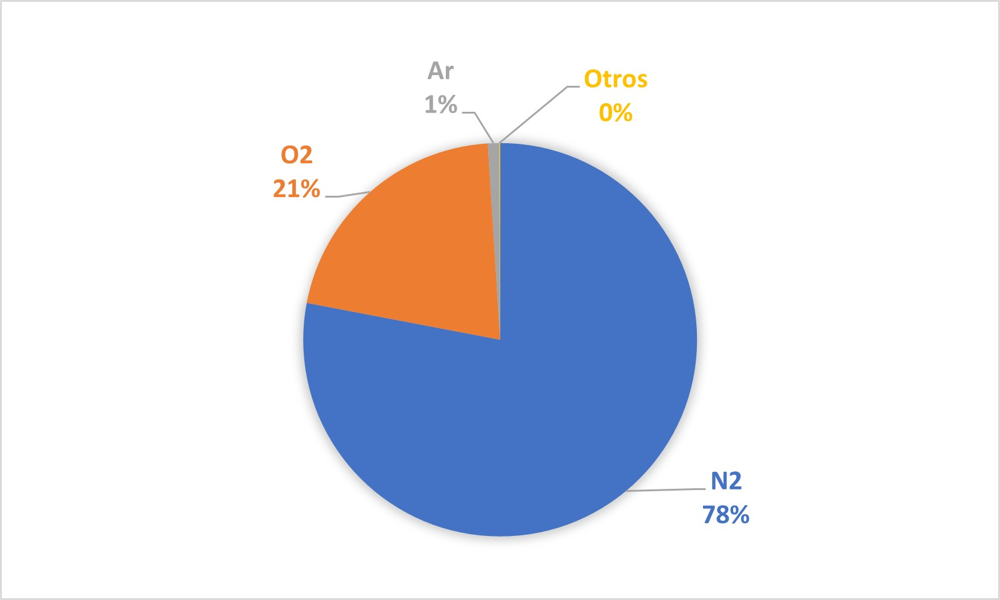
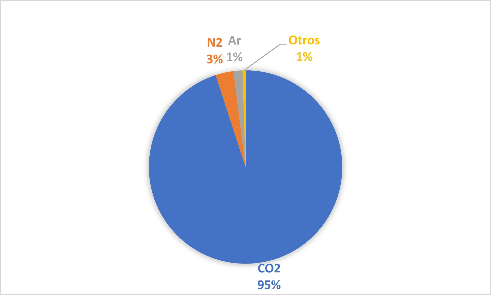
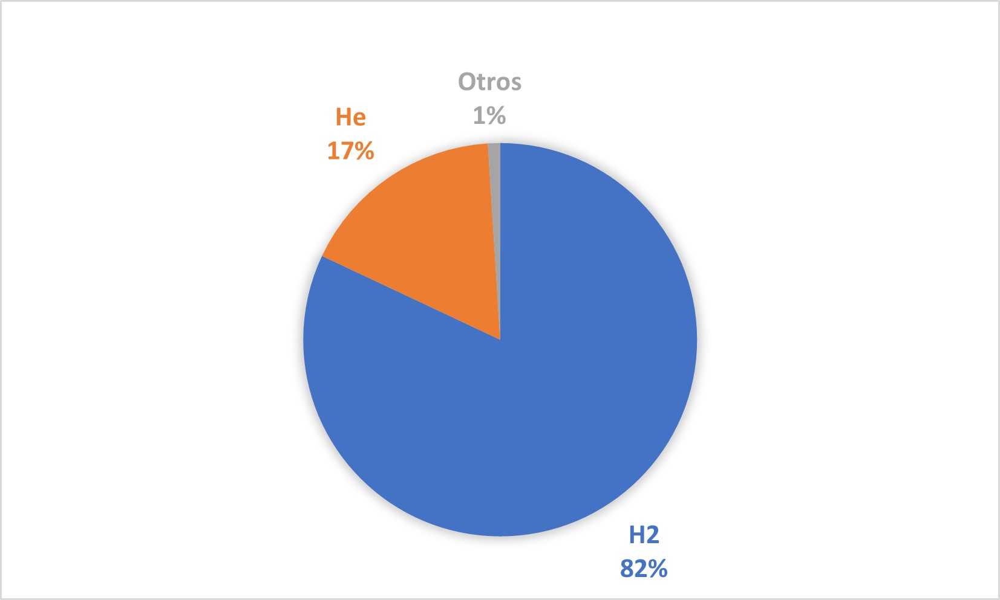
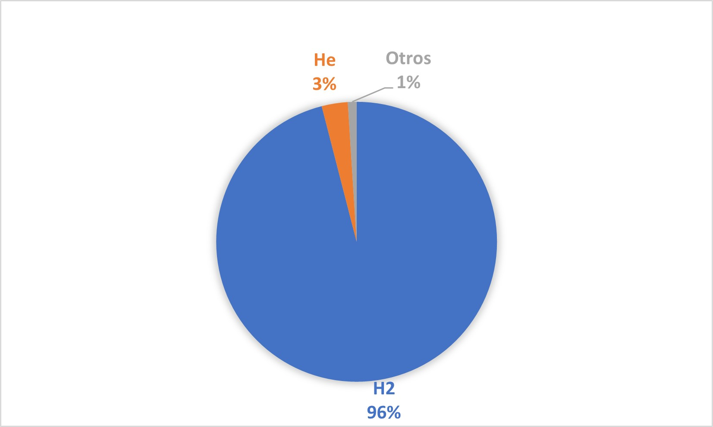
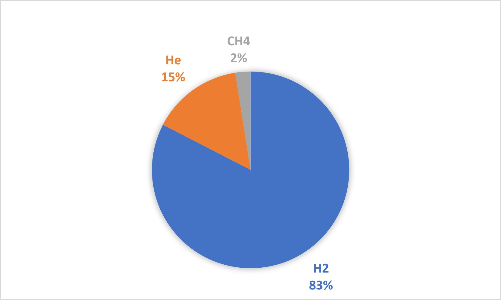
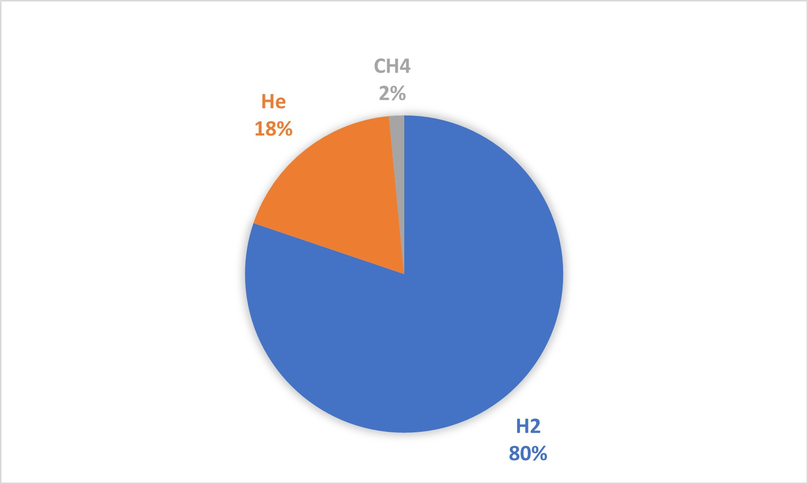

# DataSet

El link del repositorio:

[GitHUb](https://github.com/AnaLopezP/DataSet.git)
https://github.com/AnaLopezP/DataSet.git

El grupo esta formado por Andrea Manuel y Ana Lopez

# INTRODUCCIÓN AL DATASET

Los principales datos que hemos recopilado han sido:
- de la tripulacion (inventada)
- de los planetas
- del experimento
- de las condiciones necesarias para sobravivir

Los astronautas, al despertarse, evaluaron ciertos datos para averiguar en que planeta se encontraban. Primero, calcularon con su velocidad de viaje, el tiempo que han estado dormidos. Segundo, calcularon tiempos de caida de un objeto para aproximar la gravedad del planeta en el que estan. Calculando el error en estos últimos datos, dan por hecho que estan sobre el planeta que menos error haya dado, Saturno.

# DETALLES DEL DATASET

1) Informacion de los planetas: gráficas
  - Gases que hay en las atmosferas:
  Gases de la Tierra                                    Gases de Marte                                  Gases de Júpiter
  
                                         
  
  Gases de Saturno                                      Gases de Urano                                  Gases de Neptuno
  
                                                     
  
        En estas gráficas podemos observar el porcentaje que hay de los gases predominantes en cada planeta.
  - Comparación de tamaño (masa, radio, gravedad)
        En estas gráficas comparamos los tamaños de los planetas en distintos aspectos: masa, radio y gravedad
  - Relación de la masa con la fuerza de atracción
        En estas gráficas vemos la relación que tiene el tamaño y masa de cada planeta con la fuerza de atracción.

2) Informacion de la tripulación: gráficas
  - Edad media
  - Masa media
  - Altura media
  - Peso medio tierra
  - Peso medio Saturno
  - Variación del peso en el viaje (pérdida de masa muscular)
      Cuando se hace un viaje espacial de muchos meses, se empieza a perder un porcentaje de masa muscular cada cierto tiempo. Hemos calculado la masa que les quedarían a la tripulación una vez cubren la distancia hacia cada planeta. Estas gráficas comparan, en cada tripulante, la masa inicial con la restante en todo el proceso de pérdida.
  
3) Condiciones de supervivencia
  - Porcentaje de supervivencia comparación
      En esta lista hemos hecho una recopilación de las cosas que serían necesarias para poder sobrevivir en cada planeta. Cuantos menos artilugios externos se necesiten, más fácil es sobrevivir en el planeta. Por tanto hemos hecho una comparación de las posibilidades que tandría la tripulación de sobrevivir. (Cuanto más alto el porcentaje, mas posibilidades)
      

4) Investigacion del planeta en el que se encuentra la tripulación
  - Comparación de los errores calculados
    Esta gráfica hace una comparación de los errores calculados al averiguar el planeta en el que estan (método explicado al principio del README)
   
5) Información de Saturno
  
